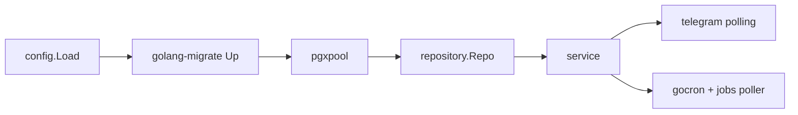

# План: ТЗ и реализация telegram-tracker по конвенциям playtronix/user

## Что берём из референса

Из `D:\projects\playtronix\migration\user` переносим только раскладку слоёв и работу с миграциями:

- `golang-migrate/v4` + `iofs` + `embed.FS` вместо goose;
- файлы `migrations/postgres/000001_init.up.sql` и `000001_init.down.sql` (6 цифр, парные up/down);
- `migrations/migrations.go` с `//go:embed postgres` и функцией-геттером;
- миграции применяются в `main` до инициализации репозитория, при ошибке процесс падает, версия пишется в лог;
- полный `down` запрещён, поддерживаются `up`, `to_version`, `step_back`;
- слои `cmd/bot/main.go` + `internal/{config,model,repository,service,...}`, интерфейс `Repo` и структура `repo{pool, log}`;
- пул БД настраивается (max open/idle conns, conn max lifetime/idle time).

Не берём: GORM, viper с `config.yaml`, zap, gin, NSQ/NATS/Redis. Остаются `pgx`, `.env`, `log/slog`, `telebot`, `gocron`. Docker Compose: `postgres` + `bot`, данные в `./data/postgres`.

## Часть 1. Правки в docs/telegram-tracker-go-tz.md

Файл: [docs/telegram-tracker-go-tz.md](../telegram-tracker-go-tz.md)

- **Раздел 2 (стек)**: заменить строку про `pressly/goose/v3` на `golang-migrate/v4` (`database/postgres` + `source/iofs`). Добавить, что `*sql.DB` для мигратора открывается через `pgx/v5/stdlib`, а приложение работает через `pgxpool`.
- **Раздел 3 (конфигурация)**: добавить в `.env` управление миграциями и пулом:

```env
MIGRATION_DIRECTION=up
MIGRATION_VERSION=0
DB_MAX_OPEN_CONNS=10
DB_MAX_IDLE_CONNS=5
DB_CONN_MAX_LIFETIME=1h
DB_CONN_MAX_IDLE_TIME=1h
```

- **Раздел 14 (база данных)**: переписать блок «Правила миграций»:
  - директория `migrations/postgres/`, имена `NNNNNN_snake_case.up.sql` / `.down.sql`, нумерация вперёд без дыр;
  - у каждой миграции есть `down`, либо она явно помечена irreversible с пояснением;
  - таблица версий `schema_migrations`; при dirty-состоянии старт прерывается с указанием версии;
  - `direction=up` по умолчанию, полный `down` не поддерживается, откат только `step_back` или `to_version`;
  - `CREATE TABLE IF NOT EXISTS` / `CREATE INDEX IF NOT EXISTS`, `down` дропает индексы, затем таблицу;
  - запрет на `CREATE TABLE` из Go-кода и любые ORM-автомиграции.
- **Раздел 19 (структура проекта)**: раскладка `cmd/bot`, `internal/{config,model,repository,service,telegram,scheduler,errorx}`, `migrations/postgres`.
- **Раздел 23 (запуск)**: порядок старта: миграции → пул → планировщик → polling.
- **Раздел 24 (DoD)**: golang-migrate и парные `.up.sql`/`.down.sql`.
- Описание слоёв: транспорт в `telegram/`, бизнес-логика в `service/`, SQL только в `repository/`, `model` не протекает в хендлеры.



## Часть 2. Дорожная карта реализации

Каждый этап — рабочий инкремент, который собирается и запускается.

1. **Скелет**: `go.mod` (Go 1.26), каталоги, `internal/config` (чтение и валидация env, без viper), `slog` в stdout, `cmd/bot/main.go` с `signal.Notify(SIGINT, SIGTERM)` и отменой контекста.
2. **Миграции и БД**: `migrations/migrations.go` с `//go:embed postgres`, `000001_init.{up,down}.sql` со всеми таблицами из раздела 14 ТЗ, раннер на `migrate.NewWithInstance`, затем `pgxpool`.
3. **Repository**: `internal/model` + интерфейс `Repo` и `repo{pool, log}`; методы для check-in, follow-up, итога дня (`ON CONFLICT (user_id, local_date)`), jobs (`FOR UPDATE SKIP LOCKED`), users (upsert при первом обращении, `is_active`). Каждый запрос фильтрует по `user_id`.
4. **Транспорт и check-in**: `internal/telegram` на telebot, `internal/service` с FSM `IDLE → ... → COMPLETE`, состояние в `map[int64]*Conversation` под мьютексом.
5. **Расписание**: `internal/scheduler` — gocron по `CHECKIN_TIMES` с рассылкой активным пользователям, поллер `jobs` для follow-up и snooze, `JOB_GRACE_MIN`, деактивация заблокировавших бота.
6. **История и итог дня**: `/today`, `/history`, `/edit`, экран дня, правка отдельных полей с проверкой владельца записи.
7. **Статистика**: `/stats` за 7 дней, включая среднее снижение тяги после follow-up.
8. **Инфраструктура**: `Dockerfile`, `docker-compose.yml` (`postgres` + `bot`, bind-mount `./data/postgres`), `.dockerignore`, `.env.example`, `Makefile`, `README.md`.
